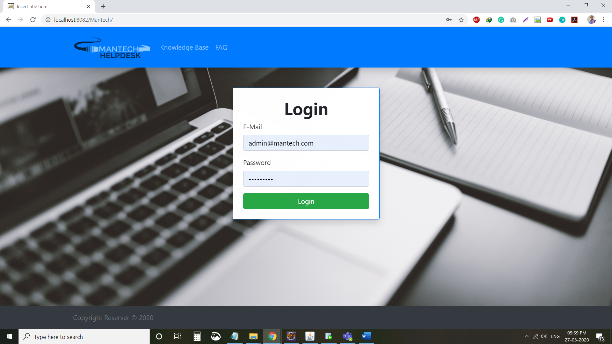
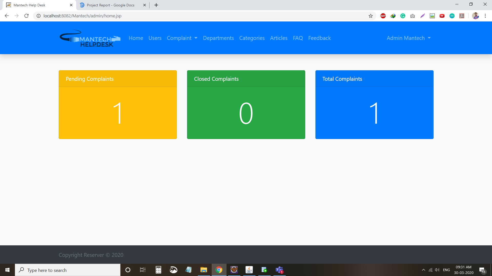
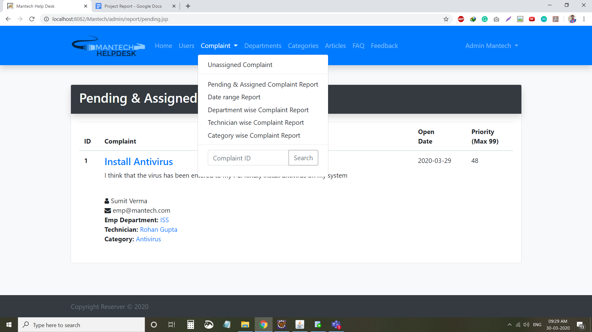
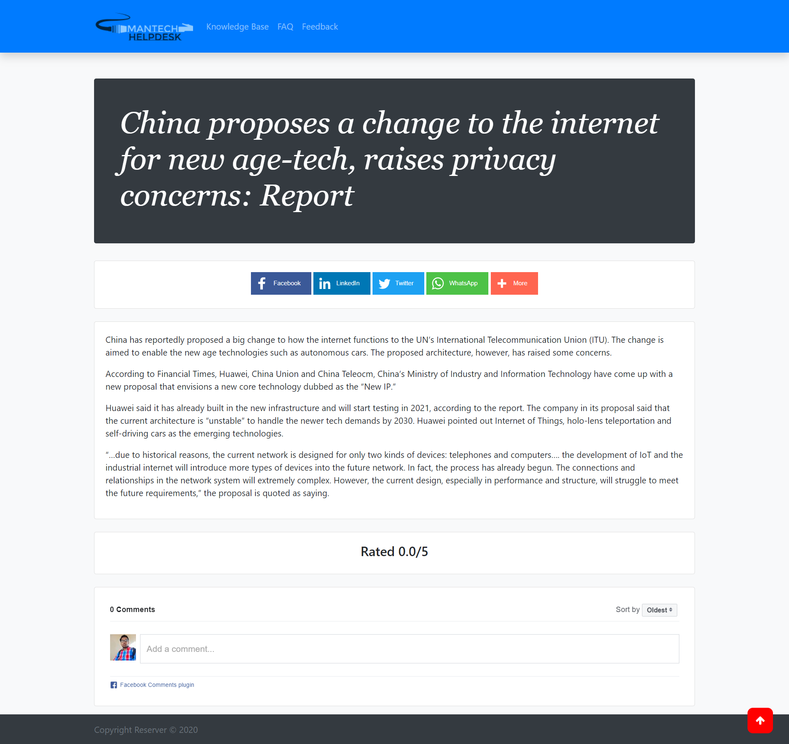

# Mantech-helpdesk

## Overview:
Complaint Management System
Mantech Limited implements Customer Helpdesk Management for Technical Support. It is encountered that there are too many requests. So, registration of these complaints/queries is automated which involves filling of complaint forms and assigning the complaint to the technician.

Bring admin, employees, and support teams together using a common platform to speed service requests.

With Mantech HelpDesk you can easily receive, track, manage, and resolve complaints. Employees can send complaints through our website. Mantech HelpDesk organizes and prioritizes these requests in a single place.

## Technologies Used
- Servlet JSP
- Oracle XE
- Bootstrap 4
- jQuery
- Javascript
- CSS
- HTML
- Facebook comment plugin
- AddThis Share plugin
- CKEditor
- Google Analytics

## Some Screenshots

